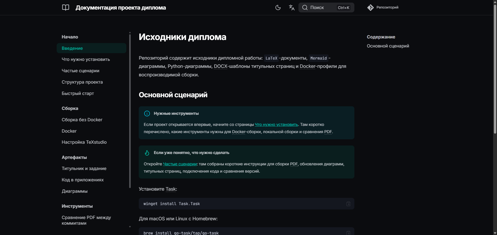

# Исходники диплома


<!-- DIPLOMA_HASHES_START -->
## Контрольные суммы PDF

MD5: `0399ed5f7a4b9c520712e20bd8cacb5e`<br>
SHA-1: `71260926fe8f4da191e27ad8f1d9b1c5d153a50e`<br>
SHA-256: `7b298cfc78faf40d189864c71ce1cd8046c28de2f3e45e73e9128f1ac7faa1c5`<br>
SHA3-256: `28d8e2e224861a49c21bc15f277a2e2f64476b7d143197afd34ea7134a4aa09f`<br>
BLAKE2s: `4c566b93871a6e9dc5adffbf93fbffb4e80674ffad7d06a555cc635ed0f2e4be`<br>
SHAKE-128 (256-bit output): `6384d4828a9a4106f8565d3746fa97434dab275ca3c009aead405be1004cf8f9`<br>
<!-- DIPLOMA_HASHES_END -->

Репозиторий с исходниками дипломной работы: `LaTeX`-документы, `Mermaid`-диаграммы, Python-диаграммы, DOCX-шаблоны титульных страниц и Docker-профили для воспроизводимой сборки.

## Что внутри

| Путь | Назначение |
| --- | --- |
| `*.tex`, `preamble/` | LaTeX-документы и настройки преамбулы |
| `docx/` | DOCX-исходники титульника и задания |
| `mermaid/` | Исходники Mermaid-диаграмм |
| `python_diagrams/` | Python-скрипты генерации диаграмм |
| `figures/` | Сгенерированные изображения и PDF для вставки в документ |
| `scripts/` | Вспомогательные скрипты сборки, конвертации и сравнения PDF |
| `docker/` | Dockerfile для отдельных профилей сборки |
| `docs/ru/`, `docs/en/` | Zensical-документация проекта и ассеты документации |
| `docs/includes/` | Общие Markdown-вставки для Zensical-документации |
| `Taskfile.yml`, `tasks/` | Единая точка входа Task и тематические файлы задач; карта задач лежит в `tasks/README.md` |

## Установка Task

Проект использует [Task](https://taskfile.dev/docs/installation) как единую точку входа для сборки и вспомогательных команд. Корневой `Taskfile.yml` подключает тематические файлы из `tasks/`, но публичные команды остаются плоскими: `task build`, `task docs`, `task latex:docker`.

Windows:

```powershell
winget install Task.Task
```

macOS или Linux с Homebrew:

```bash
brew install go-task/tap/go-task
```

Любая платформа с Node.js:

```bash
npm install -g @go-task/cli
```

Если эти варианты не подходят, используйте официальную инструкцию установки: <https://taskfile.dev/docs/installation>.

Проверить установку:

```bash
task --version
task --list
```

Проверить окружение проекта:

```bash
task check
```

Если Python еще не установлен и нужно только проверить окружение, скачайте `diploma-latex-check.exe` из GitHub Releases, положите файл в корень проекта и запустите:

```powershell
.\diploma-latex-check.exe
```

Проверка выполнится без установленного Python для запуска скрипта, но сама сборка LaTeX без Docker все равно потребует команду `python` в `PATH`, потому что документ использует PyLuaTeX.

Посмотреть и удалить сгенерированные артефакты сборки:

```bash
task clean:dry
task clean
```

Остановить и очистить Docker-артефакты только текущего Compose-проекта:

```bash
task clean:docker:dry
task clean:docker
task clean:docker:images
```

Проверить форматирование Python-файлов через Black:

```bash
task python:lint
```

## Быстрый старт

```bash
task build:images
task build
```

Макисмальная воспроизводимость с оригиналом будет, если вы будете собирать `Mermaid`-диаграммы из-под `Windows`. Если собирать их Docker-ом, то шрифт для `KaTeX` (математических) выражений будет отличаться от оригинала. Если это для вас неважно, просто пользуйтесь скриптом выше.

Для запуска скрипта потребуется Docker. Если вы не планируете использовать Docker, рекомендуемый вариант сборки LaTeX-документа - `latexmk`.
Если `task` не установлен, используйте исходные команды напрямую: `docker compose --profile docx --profile mermaid --profile python --profile latex build` и `python scripts/build_all.py`.

## Навигация

- [Документация](#документация)
- [Установка Task](#установка-task)
- [Сборка без Docker](#сборка-без-docker)
- [Настройка TeXstudio](#настройка-texstudio)
- [Компиляция в Docker](#компиляция-в-docker)
- [Сравнение PDF между коммитами](#сравнение-pdf-между-коммитами)
- [Проблемы с компиляцией](#проблемы-с-компиляцией)
- [О титульнике](#о-титульнике)
- [Если нет кода](#если-нет-кода)
- [Если есть код](#если-есть-код)
- [Как работать с диаграммами](#как-работать-с-диаграммами)
- [Полностью ручная компиляция LaTeX](#полностью-ручная-компиляция-latex)
- [Git hooks](#git-hooks)

## Документация



Документация проекта лежит в `docs/` и запускается через Zensical. Русская версия находится в `docs/ru/`, английская - в `docs/en/`. Для контейнерного запуска используется официальный Docker-образ `zensical/zensical:0.0.40`.

Собрать и запустить двуязычную локальную документацию:

```bash
task docs
```

После запуска сайт доступен в браузере:

```text
http://localhost:8000
```

Команда `task docs` собирает русскую версию в `docs-site/`, английскую - в `docs-site/en/`, а затем раздает статический сайт. Переключатель языка появляется в UI через настройки `extra.alternate`.

Заранее скачать Docker-образ документации:

```bash
task docs:pull
```

Без Docker Zensical можно установить в Python-окружение:

```bash
python -m pip install zensical
zensical serve --config-file zensical.toml
zensical serve --config-file zensical.en.toml
```

## Сборка без Docker

Рекомендуемый способ сборки без Docker - `latexmk`. Он сам запускает `lualatex` и `biber` нужное количество раз по правилам из `.latexmkrc`.

!!! warning "Важно"
    В этом проекте `latexmk` заметно сокращает время повторной компиляции. Первый запуск через `latexmk` занимает около 74 секунд, повторный - около 18 секунд. Режим `--no-latexmk` с ручной цепочкой каждый раз занимает примерно 53-54 секунды.

Первый запуск `latexmk` может быть дольше ручной сборки, потому что он строит свое служебное состояние, анализирует зависимости, создает `.fdb_latexmk` и выполняет полный цикл сборки. На следующих запусках `latexmk` использует эту информацию и пересобирает только то, что действительно изменилось.

`latexmk` собирает только LaTeX-документ. Перед сборкой без Docker нужно отдельно подготовить все внешние артефакты, которые подключаются в `.tex`:

- `титульник.pdf` и `задание.pdf` должны лежать в корне проекта. Их можно получить из `docx/*.docx` вручную через Microsoft Word или LibreOffice. см [О титульнике](#о-титульнике)
- Mermaid-диаграммы из `mermaid/*.mmd` нужно заранее сгенерировать в `figures/`, см. [Как работать с диаграммами](#как-работать-с-диаграммами).
- Python-диаграммы нужно заранее сгенерировать командой `task diagrams` или вручную `python scripts/compile_python_diagrams.py`.
- Если в приложениях подключается код, он должен лежать по пути, на который указывает проект, см. [Если есть код](#если-есть-код).

Если эти файлы не подготовлены, `latexmk` может завершиться ошибкой из-за отсутствующих PDF, изображений или листингов.

1. Установить дистрибутив `LaTeX`. Под Windows рекомендуется установить `TeX Live`. Установка долгая, но все пакеты сразу скачаются вместе с дистрибутивом. `latexmk` обычно поставляется вместе с установкой `TeX Live`, поэтому отдельно его ставить не нужно. Компилятор в работе использовался `LuaLaTeX`.
2. Установить Python и убедиться, что команда `python` доступна в `PATH`. Python нужен не только вспомогательным скриптам: LaTeX-документ использует PyLuaTeX во время компиляции.
3. Клонировать репозиторий
4. Установить Python-зависимости для скриптов:

    ```bash
    task deps
    ```

    Или вручную:

    ```bash
    pip install -r requirements.txt
    ```

5. Создать в корне проекта файл `.env` и указать в нем основной `.tex` файл:

    ```env
    TARGET="Куприянов_И221_диплом.tex"
    ```

6. Собрать основной документ через `latexmk`:

    ```bash
    task latex:local
    ```

    Или напрямую через `latexmk`: `latexmk "Куприянов_И221_диплом.tex"`.

    Конфигурация находится в `.latexmkrc`: используется `LuaLaTeX` с `--shell-escape`, `biber`, вспомогательные файлы складываются в `.aux_files`, а готовый PDF остается в корне проекта. `--shell-escape` нужен PyLuaTeX, чтобы запускать Python во время компиляции.

    Для другого `.tex` файла:

    ```bash
    task latex:local -- --target "<файл>.tex"
    ```

    Или напрямую через `latexmk`: `latexmk "<файл>.tex"`.

### Сборка через Python-скрипт

Если удобнее читать `TARGET` из `.env`, можно использовать скрипт. По умолчанию он тоже собирает документ через `latexmk`:

```bash
task latex:local
```

Или вручную: `python scripts/build_latex_manual.py`.

Если нужно собрать другой файл без изменения `.env`, передайте его явно:

```bash
task latex:local -- --target "<файл>.tex"
```

Или вручную: `python scripts/build_latex_manual.py --target "<файл>.tex"`.

Если нужно отключить `latexmk` и запустить старую ручную цепочку `lualatex`, `biber`, `lualatex`, `lualatex`, передайте флаг:

```bash
task latex:manual_chain
```

Или вручную: `python scripts/build_latex_manual.py --no-latexmk`.

Этот режим медленнее на повторных сборках: в текущем проекте около 53-54 секунд каждый раз против примерно 18 секунд при повторном запуске через `latexmk`.

## Настройка TeXstudio

Проект использует `LuaLaTeX` и `biblatex` с backend `biber`. Рекомендуемый вариант для TeXstudio - запускать `latexmk`, который читает настройки из `.latexmkrc`.

1. Откройте `Options` $\rightarrow$ `Configure TeXstudio` $\rightarrow$ `Commands`.
2. В поле `Latexmk` укажите:

    ```text
    latexmk %.tex
    ```

3. Откройте `Options` $\rightarrow$ `Configure TeXstudio` $\rightarrow$ `Build`.
4. В `Default Compiler` выберите `Latexmk`.

Перед первой сборкой убедитесь, что `python`, `latexmk`, `lualatex` и `biber` доступны в `PATH`. При установке `TeX Live` команды `latexmk`, `lualatex` и `biber` обычно уже доступны вместе с дистрибутивом. Python нужен PyLuaTeX во время компиляции LaTeX. Готовый PDF будет создан в корне проекта, вспомогательные файлы - в `.aux_files`.

## Компиляция в Docker

1. Создайте в корне проекте файл `.env`

    Наполните его содержимое:

    ```
    VAULT_PATH="путь монтирования"
    VAULT_OS_PATH="фактический путь до кода на устройстве"
    TARGET="файл латеха"
    ```

    Пример:

    ```
    VAULT_PATH="/vault_code"
    VAULT_OS_PATH="../vault_diploma"
    TARGET="Куприянов_И221_диплом.tex"
    ```

    Пояснение:

    - `VAULT_PATH`: любой абсолютный unix путь. 
    - `VAULT_OS_PATH`: где относительно текущей папки лежит код
    - `TARGET`: `.tex` файл

2. Соберите LaTeX-образ:

    ```bash
    task build:image -- latex
    ```

    Или вручную: `docker compose --profile latex build`.

3. Запустите компиляцию:

    ```bash
    task latex:docker
    ```

    Или вручную: `docker compose --profile latex run --build --rm latex`.

    Профиль `latex` запускает скрипт `scripts/build_latex_docker.py`. Он читает `TARGET` из переменных окружения и собирает документ через `latexmk`. Вспомогательные файлы складываются в `.aux_files_docker`, а готовый PDF остается в корне проекта.

Первый build будет долгим. Команда `task latex:docker` и ручной вариант с `run --build` проверяют актуальность образа перед запуском, поэтому после изменения Dockerfile не нужно отдельно помнить про пересборку.

### Сборка Docker-образов

Собрать все Docker-образы проекта:

```bash
task build:images
```

Собрать образ отдельного профиля:

```bash
task build:image -- latex
task build:image -- mermaid
task build:image -- python
task build:image -- docx
```

Или вручную:

```bash
docker compose --profile latex build
docker compose --profile mermaid build
docker compose --profile python build
docker compose --profile docx build
```

Скрипты `scripts/build_all.py` и `scripts/diff_pdf_commits.py` не пересобирают образы при каждом запуске. Если Docker-образов еще нет, сначала выполните `task build:images` или ручную сборку нужных образов.

### Профили Docker Compose

В проекте доступны профили:

- `latex` - компиляция LaTeX-документа
- `mermaid` - генерация Mermaid-диаграмм в `figures`
- `python` - генерация Python-диаграмм в `figures`
- `docx` - конвертация файлов `docx/*.docx` в одноименные PDF в корне проекта

Запуск отдельных профилей:

```bash
task latex:docker
task mermaid:docker
task diagrams:docker
task docx
```

Или вручную:

```bash
docker compose --profile latex run --build --rm latex
docker compose --profile mermaid run --build --rm mermaid_diagrams
docker compose --profile python run --build --rm python_diagrams
docker compose --profile docx run --build --rm docx_pdf
```

Запуск всех профилей одной командой:

```bash
task compose:up
```

Или вручную: `docker compose --profile docx --profile mermaid --profile python --profile latex up`.

При запуске всех профилей Docker Compose стартует сервисы вместе. Если нужно гарантированно собрать документ уже со свежими PDF из DOCX и диаграммами, сначала запустите профили `docx`, `mermaid` и `python`, затем профиль `latex`.

Последовательный запуск всех профилей уже вынесен в скрипты:

```bash
task build
```

Скрипты запускают профили в порядке `docx` $\rightarrow$ `mermaid` $\rightarrow$ `python` $\rightarrow$ `latex` и останавливаются на первой ошибке.
Перед первым запуском скрипта соберите образы командой из раздела [Сборка Docker-образов](#сборка-docker-образов).

Все вспомогательные скрипты проекта написаны на Python и запускаются одинаково в Windows, Linux и macOS:

```bash
task build
task mermaid
task diagrams
```

Или вручную:

```bash
python scripts/build_all.py
python scripts/compile_mermaid.py
python scripts/compile_python_diagrams.py
```

Скрипт `scripts/convert_docx_to_pdf.py` обычно запускается внутри Docker-профиля `docx`, потому что ему нужны LibreOffice, Ghostscript и qpdf.

## Сравнение PDF между коммитами


Если нужно посмотреть визуальную разницу между двумя версиями диплома, используйте скрипт:

```bash
task diff -- <commit_1> <commit_2>
```

Или вручную: `python scripts/diff_pdf_commits.py <commit_1> <commit_2>`.

Скрипт принимает 2 хэша коммита, по очереди переключается на каждый из них, собирает PDF через Docker, складывает две версии во временную папку и открывает `diff-pdf`.

Результат можно только открыть, только сохранить или сделать оба действия:

```bash
task diff -- <commit_1> <commit_2> --view
task diff -- <commit_1> <commit_2> --save
task diff -- <commit_1> <commit_2> --view --save
task diff -- <commit_1> <commit_2> --save path/to/diff.pdf
```

Для ручного запуска замените начало команды на `python scripts/diff_pdf_commits.py`.

Без `--view` и `--save` скрипт открывает diff. При `--save` без пути результат сохраняется в `.pdf_diff/saved`.

Скачать `diff-pdf` можно в [репозитории](https://github.com/vslavik/diff-pdf/)

По умолчанию запускаются все профили в порядке `docx` $\rightarrow$ `mermaid` $\rightarrow$ `python` $\rightarrow$ `latex`. Если нужно ограничить сборку, передайте опцию `--profiles`:

```bash
task diff -- <commit_1> <commit_2> --profiles all
task diff -- <commit_1> <commit_2> --profiles docx
task diff -- <commit_1> <commit_2> --profiles mermaid
task diff -- <commit_1> <commit_2> --profiles python
task diff -- <commit_1> <commit_2> --profiles mermaid,python
task diff -- <commit_1> <commit_2> --profiles latex
```

Пояснение:

- `all`: `docx` $\rightarrow$ `mermaid` $\rightarrow$ `python` $\rightarrow$ `latex`
- `docx`: `docx` $\rightarrow$ `latex`
- `mermaid`: `mermaid` $\rightarrow$ `latex`
- `latex`: только `latex`
- `python`: `python` $\rightarrow$ `latex`
- `mermaid,python`: `mermaid` $\rightarrow$ `python` $\rightarrow$ `latex`

В `--profiles` можно передать несколько профилей через запятую: `docx,python`, `mermaid,python`, `docx,mermaid,python`. Скрипт запускает их в порядке `docx` $\rightarrow$ `mermaid` $\rightarrow$ `python` $\rightarrow$ `latex`. Если `latex` не указан явно, он добавляется автоматически, потому что именно этот профиль собирает итоговый PDF для сравнения.

Перед запуском рабочее дерево Git должно быть чистым. После завершения скрипт возвращается на исходный `HEAD`, удаляет временные файлы и восстанавливает текущие файлы из `figures`, а также PDF в корне проекта, например `титульник.pdf` и `задание.pdf`.

## Проблемы с компиляцией

Если вы используете `latexmk`, вручную повторять компиляцию не нужно: он сам запускает `lualatex` и `biber` столько раз, сколько требуется. Повторные ручные запуски нужны только при полностью ручной компиляции из последнего раздела README.

Если не компилируется:

Запустите команду из `cmd`, не из `powershell`. Если не сработало:

1. Переименуйте `.tex` файл в `main.tex` (или любое другое название на латинице)

2. Используйте следующую команду для компиляции:

    ```bash
    task latex:local -- --target main.tex
    ```

    Или напрямую через `latexmk`: `latexmk main.tex`.

### О титульнике

`LaTeX` вставит титульник из файла `титульник.pdf` в начало файла. Поэтому он должен быть в проекте перед компиляцией (как и все рисунки, листинги). В проекте есть `docx/титульник.docx` и `docx/задание.docx`; их можно конвертировать через Docker:

```bash
task docx
```

Или вручную: `docker compose --profile docx up`.

Профиль берет все файлы `docx/*.docx` и складывает одноименные PDF в корень проекта, например `docx/титульник.docx` $\rightarrow$ `титульник.pdf`.

При конвертации профиль пропускает пустые страницы. Если нужно сохранить PDF как есть, запустите профиль с переменной `SKIP_BLANK_PAGES=0`:

```bash
task docx:keep-blank
```

Или вручную: `docker compose --profile docx run --rm -e SKIP_BLANK_PAGES=0 docx_pdf`.

Альтернативный вариант - открыть DOCX в Microsoft Word и экспортировать его в PDF вручную: `Файл` $\rightarrow$ `Экспорт` $\rightarrow$ `Создать PDF/XPS`. Для титульника и задания нужно сохранить PDF в корень проекта с именами `титульник.pdf` и `задание.pdf`.

### Если нет кода

Если у вас нет файлов кода, и вы хотите скомпилировать проект без них, закомментируйте эти строки в конце `.tex` файл (в `latex` комментарии - все строки, содержащие `%` в начале)

```latex
\newpage
\input{appendix_b.tex}
\newpage
\input{include_listings.tex}
```

### Если есть код

Положите код на одном уровне с папкой `LaTeX` кода. При компиляции `LaTeX` обращается по такому пути:

`../vault_diploma/<файл>`

## Как работать с диаграммами

### Просмотр Mermaid-файлов на GitHub

GitHub не всегда показывает содержимое файлов Mermaid с расширением `.mmd` как обычный текстовый код. Если вместо исходника отображается предпросмотр или файл не открывается удобным образом, нажмите кнопку `View raw` на странице файла. Так GitHub откроет исходный `.mmd`-код диаграммы без обработки.

### Сборка вручную

Чтобы пересобрать диаграмму в `pdf`:

1. Отредактируйте нужную диаграмму (они содержатся в файлах `.mmd`)
2. Установите инструмент командой строки `mmdc` : https://github.com/mermaid-js/mermaid-cli
3. Пересоберите диаграмму:
    
    ```bash
    mmdc -i <file.mmd> -o <file.pdf> -f
    ```

    флаг `-f` нужен для того, чтобы лист pdf обрезался под размер диаграммы

### Автоматическая сборка всех Mermaid диаграмм

Запустите скрипт `scripts/compile_mermaid.py` в проекте. Этот скрипт автоматически прогонит все файлы из папки `mermaid` и положит результат в папку `figures`

```bash
task mermaid
```

Или вручную: `python scripts/compile_mermaid.py`.

### Сборка Mermaid через Docker

```
task mermaid:docker
```

Или вручную: `docker compose --profile mermaid up`.

### Генерация диаграмм Python вручную

1. Установите интерпретатор `python` (использовалась версия `3.13+`)
2. Установите в окружение библиотеки: `task deps` или вручную `pip install -r requirements.txt`
3. Теперь вы можете запустить скрипт и получить на выходе файл диаграммы

    ```bash
    task diagrams
    ```

    Или вручную: `python scripts/compile_python_diagrams.py`.

### Генерация диаграмм Python через Docker

```bash
task diagrams:docker
```

Или вручную: `docker compose --profile python up`.

## Полностью ручная компиляция LaTeX

Этот способ нужен только для диагностики или если `latexmk` недоступен. В обычной сборке без Docker используйте `latexmk`, потому что он сам определяет нужное количество запусков `lualatex` и `biber`. Первый запуск `latexmk` в этом проекте может занимать около 74 секунд, зато повторные сборки сокращаются примерно до 18 секунд. Ручная цепочка через `--no-latexmk` каждый раз занимает около 53-54 секунд. В скрипте `scripts/build_latex_manual.py` этот режим включается флагом `--no-latexmk`.

Создайте папку для вспомогательных файлов:

```bash
mkdir .aux_files
```

Так как проект использует `biblatex` с backend `biber` и PyLuaTeX, одного запуска `lualatex` недостаточно, а каждый запуск `lualatex` должен идти с `--shell-escape`:

```bash
lualatex --shell-escape -synctex=1 -interaction=nonstopmode -output-directory=".aux_files" "<файл>.tex"
biber ".aux_files/<файл>.bcf"
lualatex --shell-escape -synctex=1 -interaction=nonstopmode -output-directory=".aux_files" "<файл>.tex"
lualatex --shell-escape -synctex=1 -interaction=nonstopmode -output-directory=".aux_files" "<файл>.tex"
```

Для основного файла проекта:

```bash
lualatex --shell-escape -synctex=1 -interaction=nonstopmode -output-directory=".aux_files" "Куприянов_И221_диплом.tex"
biber ".aux_files/Куприянов_И221_диплом.bcf"
lualatex --shell-escape -synctex=1 -interaction=nonstopmode -output-directory=".aux_files" "Куприянов_И221_диплом.tex"
lualatex --shell-escape -synctex=1 -interaction=nonstopmode -output-directory=".aux_files" "Куприянов_И221_диплом.tex"
```

После сборки итоговый PDF окажется в `.aux_files`. Его нужно перенести в корень проекта:

```bash
mv ".aux_files/<файл>.pdf" .
```

В Windows `cmd` для основного файла:

```bat
move ".aux_files\Куприянов_И221_диплом.pdf" .
```

## Git hooks

Чтобы перед каждым коммитом автоматически обновлялись контрольные суммы итогового PDF в README, подключите локальные hooks:

```bash
task hooks
```

Или вручную: `git config core.hooksPath .githooks`.

Для работы hook нужен Python-пакет `python-dotenv`. Он уже указан в `requirements.txt`; если окружение еще не подготовлено, установите зависимости:

```bash
task deps
```

Или вручную: `pip install -r requirements.txt`.

Hook считает хэши текущего PDF алгоритмами из стандартного `hashlib`. Если PDF отсутствует, README не меняется и коммит продолжается со старым значением.

## Лицензия

Репозиторий использует смешанную некоммерческую схему лицензирования, описанную в [LICENSE.md](LICENSE.md): код и автоматизация распространяются по PolyForm Noncommercial License 1.0.0, документация и авторские материалы - по Creative Commons Attribution-NonCommercial 4.0 International. Коммерческое использование возможно только по отдельному письменному согласованию с автором.

Шрифты в `fonts/latin-modern-mono/` распространяются отдельно по GUST Font License из `fonts/latin-modern-mono/GUST-FONT-LICENSE.TXT`.
