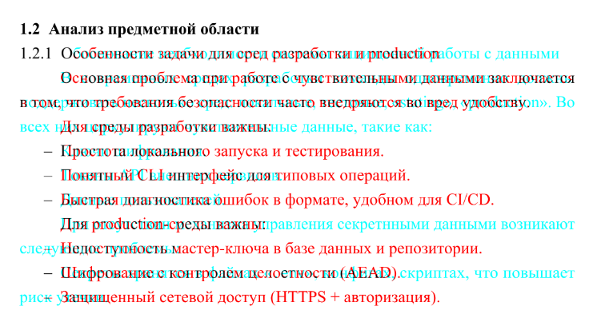

# Исходники диплома

<!-- DIPLOMA_HASHES_START -->
## Контрольные суммы PDF

**MD5:** `740433db4b0a653e425ec6a009615937`
**SHA-1:** `4219b9abbb7952d04f2160b42c299e1a8c48dbf5`
**SHA-224:** `bf5996e4236e6a6622908ee0075a1e84e03de370f1a81985a8551d75`
**SHA-256:** `32a07f44efac636d8b4f280b3a2489e66bb257baf981e8963f0aa61ff33031c9`
**SHA-384:** `bd61fccd9e08d02bd2ece5dcce72dcb1ac6b6878ae12150bc7ff91afdcb1dd138356f4da8560258270ac3792a5e0f030`
**SHA-512:** `4b331aba8d662bd5fce8807281e3fadd4a409a575b643ee75665a7235334339c20d39033f98fbe2e05cd8202dc065beaa16e93ac582bbbba893e32cdd54e68b1`
**SHA3-224:** `f876af5edfec119c3b589d5f7d9a261eb955d1479eff2c074d6fb48f`
**SHA3-256:** `b2ced9226320f0d6b66dc3b3348b1177ee8356a52fd8b656affb6aa64eb168f3`
**SHA3-384:** `427f4a74acf9a273bb32248a2f6a344b6e897192a829239b4fb225c1661b47fd5432c385c2b5fb1829652c63fd4de750`
**SHA3-512:** `c6d9155cc49f553c796a2487680f59774c1f158d2599928582cf3749de458f5239cb12ac0c602407683af4b6581e352cbd27baf18045fada340580a1d876e159`
**BLAKE2s:** `5b2ee6163d4abc7d7226d3749e897616c453642a4f7b71d4a923f454297172fe`
**BLAKE2b:** `e5ddb90e5e3cf2279740c6187fd2f5a1b0d6acac8b720521cab0c78ce17b4101ac45eb8fcd190647ed21e5333985749a1551ef122bd6d6eda046b764daa7fb9d`
**SHAKE-128 (256-bit output):** `f3dcc478690f910b76ed355ece57d27a5bc4404fbecebbe4f330b180512cd3d5`
**SHAKE-256 (512-bit output):** `147de0be6eaca51b30b222c3af32254d26d80515114a1cba0d6364b7744e8e9a330b7f5bb79c75ff95ad86768c23081b3ff1eaa3ddc3c181fd020d34243ff73e`
<!-- DIPLOMA_HASHES_END -->

[](https://github.com/ethercod3/diploma_latex/commits)
[](https://github.com/ethercod3/diploma_latex)


Репозиторий с исходниками дипломной работы: `LaTeX`-документы, `Mermaid`-диаграммы, Python-диаграммы, DOCX-шаблоны титульных страниц и Docker-профили для воспроизводимой сборки.

## Что внутри

| Путь | Назначение |
| --- | --- |
| `*.tex`, `preamble/` | LaTeX-документы и настройки преамбулы |
| `docx/` | DOCX-исходники титульника и задания |
| `mermaid/` | Исходники Mermaid-диаграмм |
| `python_diagrams/` | Python-скрипты генерации диаграмм |
| `figures/` | Сгенерированные изображения и PDF для вставки в документ |
| `scripts/` | Вспомогательные скрипты сборки, конвертации и сравнения PDF |
| `docker/` | Dockerfile для отдельных профилей сборки |

## Быстрый старт

```bash
python scripts/build_all.py
```

Макисмальная воспроизводимость с оригиналом будет, если вы будете собирать `Mermaid`-диаграммы из-под `Windows`. Если собирать их Docker-ом, то шрифт для `KaTex` (математических) выражений будет отличаться от оригинала. Если это для вас неважно, просто пользуйтесь скриптом выше.

Для запуска скрипта потребуется Docker. Если вы не планируете использовать Docker, для вас есть инструкции по ручной сборке всего, что есть в проекте.

## Навигация

- [Как скомпилировать проект вручную](#как-скомпилировать-проект-вручную)
- [Компиляция в Docker](#компиляция-в-docker)
- [Git hooks](#git-hooks)
- [Сравнение PDF между коммитами](#сравнение-pdf-между-коммитами)
- [Проблемы с компиляцией](#проблемы-с-компиляцией)
- [Как работать с диаграммами](#как-работать-с-диаграммами)
- [Генерация диаграмм Python](#генерация-диаграмм-python-вручную)

## Как скомпилировать проект вручную

1. Установить дистрибутив `LaTeX`. Под Windows рекомендуется установить `TexLive`. Установка долгая, но все пакеты сразу скачаются вместе с дистрибутивом. Компилятор в работе использовался `LuaTex`
2. Клонировать репозиторий
3. Скомпилировать файл: 

    ```bash
    lualatex -synctex=1 -interaction=nonstopmode "<файл>".tex
    ```

## Компиляция в Docker

1. Создайте в корне проекте файл `.env`

    Наполните его содержимое:

    ```
    VAULT_PATH="путь монтирования"
    VAULT_OS_PATH="фактический путь до кода на устройстве"
    TARGET="файл латеха"
    ```

    Пример:

    ```
    VAULT_PATH="/vault_code"
    VAULT_OS_PATH="../vault_diploma"
    TARGET="Куприянов_И221_диплом.tex"
    ```

    Пояснение:

    - `VAULT_PATH`: любой абсолютный unix путь. 
    - `VAULT_OS_PATH`: где относительно текущей папки лежит код
    - `TARGET`: `.tex` файл

2. Запустите компиляцию:

    ```bash
    docker compose --profile latex up --build
    ```

Первый билд будет долгим

### Профили Docker Compose

В проекте доступны профили:

- `latex` - компиляция LaTeX-документа
- `mermaid` - генерация Mermaid-диаграмм в `figures`
- `python` - генерация Python-диаграмм в `figures`
- `docx` - конвертация файлов `docx/*.docx` в одноименные PDF в корне проекта

Запуск отдельных профилей:

```bash
docker compose --profile latex up --build
docker compose --profile mermaid up --build
docker compose --profile python up --build
docker compose --profile docx up --build
```

Запуск всех профилей одной командой:

```bash
docker compose --profile docx --profile mermaid --profile python --profile latex up --build
```

При запуске всех профилей Docker Compose стартует сервисы вместе. Если нужно гарантированно собрать документ уже со свежими PDF из DOCX и диаграммами, сначала запустите профили `docx`, `mermaid` и `python`, затем профиль `latex`.

Последовательный запуск всех профилей уже вынесен в скрипты:

```bash
python scripts/build_all.py
```

Скрипты запускают профили в порядке `docx` -> `mermaid` -> `python` -> `latex` и останавливаются на первой ошибке.

Все вспомогательные скрипты проекта написаны на Python и запускаются одинаково в Windows, Linux и macOS:

```bash
python scripts/build_all.py
python scripts/compile_mermaid.py
python scripts/compile_python_diagrams.py
```

Скрипт `scripts/convert_docx_to_pdf.py` обычно запускается внутри Docker-профиля `docx`, потому что ему нужны LibreOffice, Ghostscript и qpdf.

### Сравнение PDF между коммитами



Если нужно посмотреть визуальную разницу между двумя версиями диплома, используйте скрипт:

```bash
python scripts/diff_pdf_commits.py <commit_1> <commit_2>
```

Скрипт принимает 2 хэша коммита, по очереди переключается на каждый из них, собирает PDF через Docker, складывает две версии во временную папку и открывает `diff-pdf`.

Результат можно только открыть, только сохранить или сделать оба действия:

```bash
python scripts/diff_pdf_commits.py <commit_1> <commit_2> --view
python scripts/diff_pdf_commits.py <commit_1> <commit_2> --save
python scripts/diff_pdf_commits.py <commit_1> <commit_2> --view --save
python scripts/diff_pdf_commits.py <commit_1> <commit_2> --save path/to/diff.pdf
```

Без `--view` и `--save` скрипт открывает diff. При `--save` без пути результат сохраняется в `.pdf_diff/saved`.

Скачать `diff-pdf` можно в [репозитории](https://github.com/vslavik/diff-pdf/)

По умолчанию запускаются все профили в порядке `docx` -> `mermaid` -> `python` -> `latex`. Если нужно ограничить сборку, передайте опцию `--profiles`:

```bash
python scripts/diff_pdf_commits.py <commit_1> <commit_2> --profiles all
python scripts/diff_pdf_commits.py <commit_1> <commit_2> --profiles docx
python scripts/diff_pdf_commits.py <commit_1> <commit_2> --profiles mermaid
python scripts/diff_pdf_commits.py <commit_1> <commit_2> --profiles latex
```

Пояснение:

- `all`: `docx` -> `mermaid` -> `python` -> `latex`
- `docx`: `docx` -> `latex`
- `mermaid`: `mermaid` -> `latex`
- `latex`: только `latex`

Перед запуском рабочее дерево Git должно быть чистым. После завершения скрипт возвращается на исходный `HEAD`, удаляет временные файлы и восстанавливает текущие файлы из `figures`, а также PDF в корне проекта, например `титульник.pdf` и `задание.pdf`.

## Проблемы с компиляцией

**ВАЖНО**: компилируйте по 2 раза минимум. В первую компиляцию могут быть ошибки, так как `LaTeX` будет создавать вспомогательные файлы со счетчиками (счетчик библиографии, таблиц, рисунков.) Во вторую компиляцию `LaTeX` их подтянет.

**ВАЖНО 2**: если не компилируется:

Запустите команду из `cmd`, не из `powershell`. Если не сработало:

1. Переименуйте `.tex` файл в `main.tex` (или любое другое название на латинице)

2. Используйте следующую команду для компиляции:

    ```bash
    lualatex main.tex
    ```

### О титульнике

`LaTeX` вставит титульник из файла `титульник.pdf` в начало файла. Поэтому он должен быть в проекте перед компиляцией (как и все рисунки, листинги). В проекте есть `docx/титульник.docx` и `docx/задание.docx`; их можно конвертировать через Docker:

```bash
docker compose --profile docx up --build
```

Профиль берет все файлы `docx/*.docx` и складывает одноименные PDF в корень проекта, например `docx/титульник.docx` -> `титульник.pdf`.

При конвертации профиль пропускает пустые страницы. Если нужно сохранить PDF как есть, запустите профиль с переменной `SKIP_BLANK_PAGES=0`:

```bash
docker compose --profile docx run --rm -e SKIP_BLANK_PAGES=0 docx_pdf
```

Альтернативный вариант - открыть DOCX в Microsoft Word и экспортировать его в PDF вручную: `Файл` -> `Экспорт` -> `Создать PDF/XPS`. Для титульника и задания нужно сохранить PDF в корень проекта с именами `титульник.pdf` и `задание.pdf`.

### Если нет кода

Если у вас нет файлов кода, и вы хотите скомпилировать проект без них, закомментируйте эти строки в конце `.tex` файл (в `latex` комментарии - все строки, содержащие `%` в начале)

```latex
\newpage
\input{appendix_b.tex}
\newpage
\input{include_listings.tex}
```

### Если есть код

Положите код на одном уровне с папкой `LaTeX` кода. При компиляции `LaTeX` обращается по такому пути:

`../vault_diploma/<файл>`

## Как работать с диаграммами

### Сборка вручную

Чтобы пересобрать диаграмму в `pdf`:

1. Отредактируйте нужную диаграмму (они содержатся в файлах `.mmdc`)
2. Установите инструмент командой строки `mmdc` : https://github.com/mermaid-js/mermaid-cli
3. Пересоберите диаграмму:
    
    ```bash
    mmdc -i <file.mmdc> -o <file.pdf> -f
    ```

    флаг `-f` нужен для того, чтобы лист pdf обрезался под размер диаграммы

### Автоматическая сборка всех диаграмм

Запустите скрипт `scripts/compile_mermaid.py` в проекте. Этот скрипт автоматически прогонит все файлы из папки `mermaid` и положит результат в папку `figures`

```bash
python scripts/compile_mermaid.py
```

### Сборка через Docker

```
docker compose --profile mermaid up --build
```

## Генерация диаграмм Python вручную

1. Установите интерпретатор `python` (использовалась версия `3.13+`)
2. Установите в окружение библиотеки: `pip install -r requirements.txt`
3. Теперь вы можете запустить скрипт и получить на выходе файл диаграммы

    ```bash
    python scripts/compile_python_diagrams.py
    ```

## Генерация диаграмм Python через Docker

```bash
docker compose --profile python up --build
```

## Git hooks

Чтобы перед каждым коммитом автоматически обновлялись контрольные суммы итогового PDF в README, подключите локальные hooks:

```bash
git config core.hooksPath .githooks
```

Для работы hook нужен Python-пакет `python-dotenv`. Он уже указан в `requirements.txt`; если окружение еще не подготовлено, установите зависимости:

```bash
pip install -r requirements.txt
```

Hook считает хэши текущего PDF алгоритмами из стандартного `hashlib`. Если PDF отсутствует, README не меняется и коммит продолжается со старым значением.
