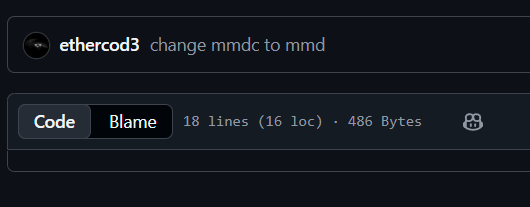
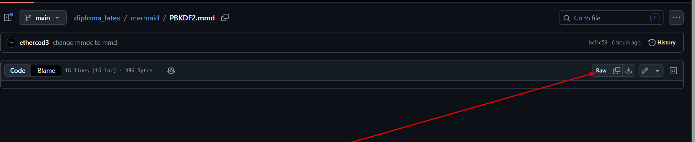

# Диаграммы

## Mermaid

Mermaid-диаграммы лежат в папке `mermaid/`, а результат сборки сохраняется в `figures/`.

## Просмотр `.mmd` на GitHub



GitHub не всегда показывает содержимое файлов Mermaid с расширением `.mmd` как обычный текстовый код. Если вместо исходника отображается предпросмотр или файл не открывается удобным образом, нажмите `View raw` на странице файла. Так GitHub откроет исходный `.mmd`-код диаграммы без обработки.




## Ручная сборка Mermaid

Чтобы пересобрать диаграмму в PDF:

1. Отредактируйте нужную диаграмму в `mermaid/*.mmd`.
2. Установите `mmdc`: <https://github.com/mermaid-js/mermaid-cli>
3. Пересоберите диаграмму:

```bash
mmdc -i <file.mmd> -o <file.pdf> -f
```

Флаг `-f` нужен, чтобы лист PDF обрезался под размер диаграммы.

## Автоматическая сборка Mermaid

Запустите скрипт:

```bash
python scripts/compile_mermaid.py
```

Скрипт прогоняет все файлы из `mermaid/` и кладет результат в `figures/`.

## Mermaid через Docker

Сборка Mermaid через Docker:

```bash
docker compose --profile mermaid up
```

## Python-диаграммы

Python-диаграммы лежат в папке `python_diagrams/`.

Ручная сборка:

1. Установите Python. В проекте использовалась версия `3.13+`.
2. Установите зависимости:

```bash
pip install -r requirements.txt
```

3. Запустите генерацию:

```bash
python scripts/compile_python_diagrams.py
```

Сборка через Docker:

```bash
docker compose --profile python up
```
