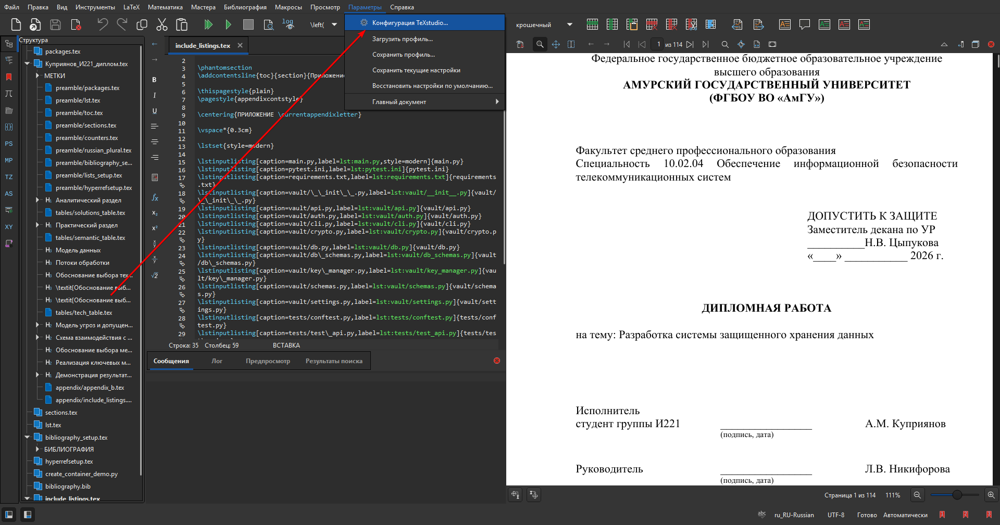
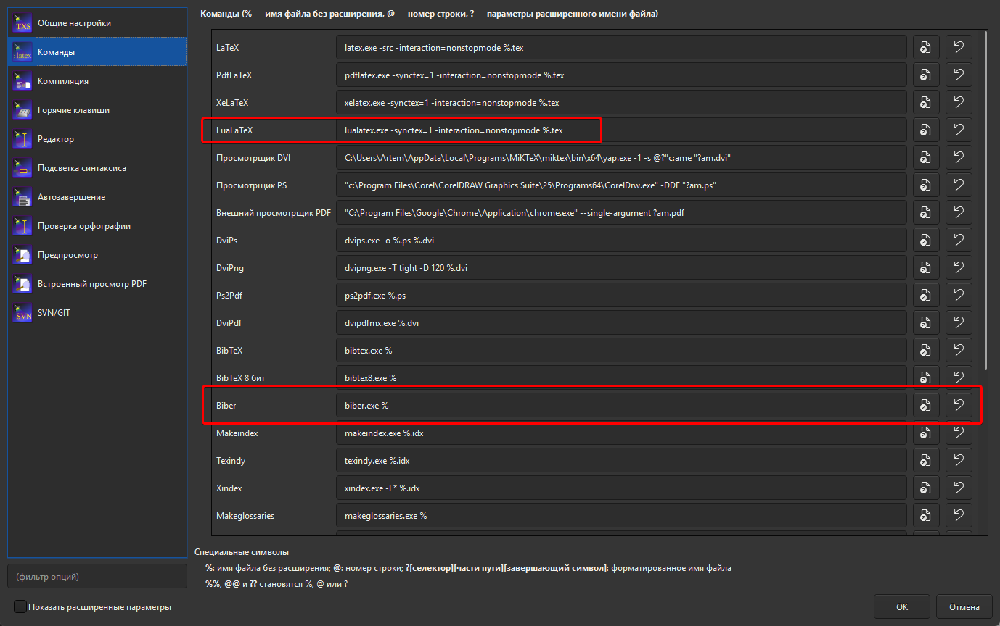

# Настройка TeXstudio

Проект использует `LuaLaTeX` и `biblatex` с backend `biber`, поэтому в TeXstudio нужно настроить сборку без `BibTeX` и без `latexmk`.

1. Откройте `Options` \\(\\rightarrow\\) `Configure TeXstudio` \\(\\rightarrow\\) `Commands`.



2. В поле `LuaLaTeX` укажите:

```text
lualatex -synctex=1 -interaction=nonstopmode -output-directory=".aux_files" %.tex
```



3. В поле `Biber` укажите:

```text
biber ".aux_files/%.bcf"
```

4. Откройте `Options` \\(\\rightarrow\\) `Configure TeXstudio` \\(\\rightarrow\\) `Build`.

5. В `Default Compiler` выберите `LuaLaTeX`.


6. В `Default Bibliography Tool` выберите `Biber`.

7. В `Build & View` выберите `User` и укажите последовательность:

```text
txs:///lualatex | txs:///biber | txs:///lualatex | txs:///lualatex | txs:///view-pdf
```

Перед первой сборкой создайте папку `.aux_files` в корне проекта, если ее еще нет. Если TeXstudio не открывает PDF автоматически, откройте файл из `.aux_files` или перенесите его в корень проекта так же, как описано в ручной сборке.
