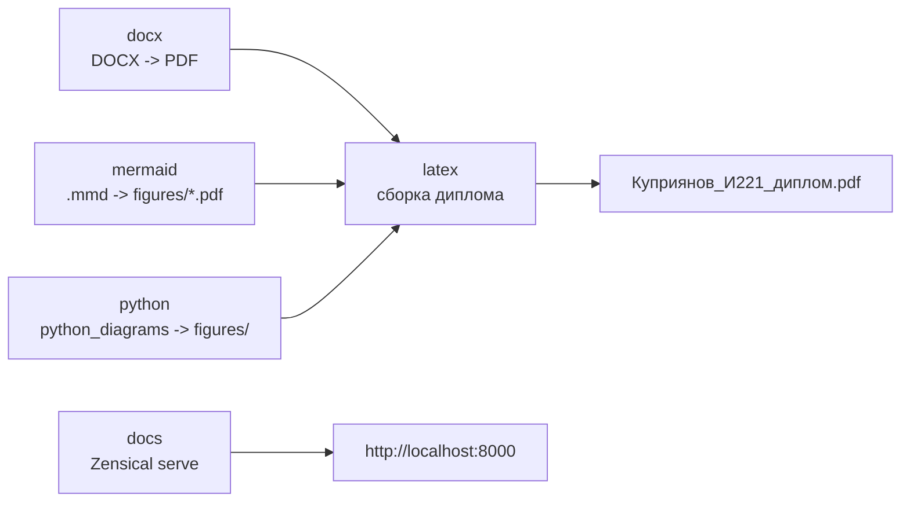
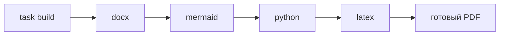

# Docker-профили



## Переменные окружения

Создайте в корне проекта файл `.env`:

```env
VAULT_PATH="путь монтирования"
VAULT_OS_PATH="фактический путь до кода на устройстве"
TARGET="файл латеха"
```

Пример:

```env
VAULT_PATH="/vault_code"
VAULT_OS_PATH="../vault_diploma"
TARGET="Куприянов_И221_диплом.tex"
```

Пояснение:

| Переменная | Назначение |
| --- | --- |
| `VAULT_PATH` | Любой абсолютный Unix-путь внутри контейнера |
| `VAULT_OS_PATH` | Где относительно текущей папки лежит код |
| `TARGET` | Основной `.tex` файл |

## LaTeX

Соберите LaTeX-образ:


=== "Task"


    ```bash
    task build:image -- latex
    ```


=== "Ручной"


    ```bash
    docker compose --profile latex build
    ```


Запустите компиляцию:


=== "Task"


    ```bash
    task latex:docker
    ```


=== "Ручной"


    ```bash
    docker compose --profile latex up
    ```


Профиль `latex` запускает `scripts/build_latex_docker.py`. Скрипт читает `TARGET` из переменных окружения и собирает документ через `latexmk`. Вспомогательные файлы складываются в `.aux_files_docker`, а готовый PDF остается в корне проекта.

## Сборка образов

Собрать все Docker-образы проекта:


=== "Task"


    ```bash
    task build:images
    ```


=== "Ручной"


    ```bash
    docker compose --profile docx --profile mermaid --profile python --profile latex build
    ```


Собрать образ отдельного профиля:


=== "Task"


    ```bash
    task build:image -- latex
    task build:image -- mermaid
    task build:image -- python
    task build:image -- docx
    ```


=== "Ручной"


    ```bash
    docker compose --profile latex build
    docker compose --profile mermaid build
    docker compose --profile python build
    docker compose --profile docx build
    ```


Скрипты `scripts/build_all.py` и `scripts/diff_pdf_commits.py` не пересобирают образы при каждом запуске. Если Docker-образов еще нет, сначала выполните `task build:images` или ручную сборку нужных образов.

## Доступные профили

В проекте используются отдельные Docker Compose профили:

| Профиль | Назначение |
| --- | --- |
| `docx` | Конвертирует DOCX-файлы из `docx/` в PDF |
| `mermaid` | Генерирует Mermaid-диаграммы в `figures/` |
| `python` | Генерирует диаграммы Python-скриптами |
| `latex` | Собирает итоговый PDF диплома |
| `docs` | Поднимает локальную Zensical-документацию |

Запуск отдельных профилей:


=== "Task"


    ```bash
    task latex:docker
    task mermaid:docker
    task diagrams:docker
    task docx
    ```


=== "Ручной"


    ```bash
    docker compose --profile latex up
    docker compose --profile mermaid up
    docker compose --profile python up
    docker compose --profile docx up
    ```


Запуск всех профилей одной командой:


=== "Task"


    ```bash
    task compose:up
    ```


=== "Ручной"


    ```bash
    docker compose --profile docx --profile mermaid --profile python --profile latex up
    ```


При запуске всех профилей Docker Compose стартует сервисы вместе. Если нужно гарантированно собрать документ уже со свежими PDF из DOCX и диаграммами, сначала запустите профили `docx`, `mermaid` и `python`, затем профиль `latex`.

Последовательный запуск всех профилей вынесен в скрипт:




=== "Task"


    ```bash
    task build
    ```


=== "Ручной"


    ```bash
    python scripts/build_all.py
    ```
