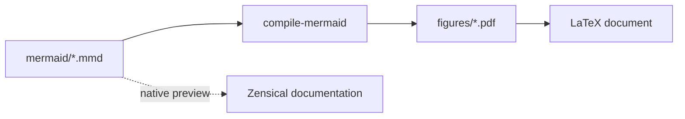
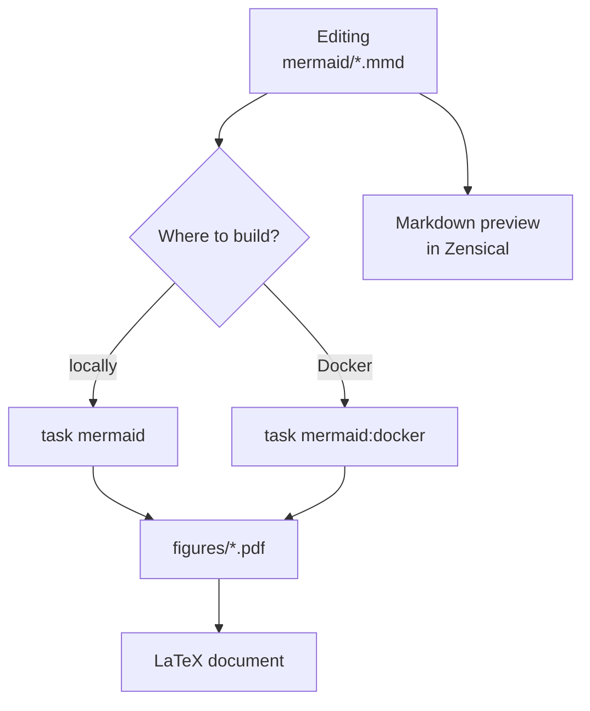

# Diagrams

## Mermaid

Mermaid diagrams are stored in `mermaid/`, and build output is saved to `figures/`.

In Zensical, Mermaid can be inserted directly into Markdown with a `mermaid` code block. Such a diagram is rendered in the browser and automatically adapts to the light or dark theme:



Diagram lifecycle in the project:



The final diploma PDF still needs generated files from `figures/`, because LaTeX includes ready images.

## Viewing `.mmd` files on GitHub


GitHub does not always show Mermaid files with the `.mmd` extension as plain text code.[^github-mermaid] If a preview is shown instead of the source, or the file is inconvenient to open, click `View raw` on the file page. GitHub will open the source `.mmd` diagram code without processing.


## Manual Mermaid build

To rebuild a diagram into PDF:

1. Edit the required diagram in `mermaid/*.mmd`.
2. Install `mmdc`: <https://github.com/mermaid-js/mermaid-cli>
3. Rebuild the diagram:

```bash
mmdc -i <file.mmd> -o <file.pdf> -f
```

The `-f` flag makes `mmdc` overwrite an existing PDF. The project automation additionally crops margins through `pdfcrop`, so local builds need `pdfcrop` and Ghostscript.

## Automatic Mermaid build

Run the script:

=== "Task"

    ```bash
    task mermaid
    ```

=== "Manual"

    ```bash
    uvx --from git+https://github.com/ethercod3/compile_mermaid.git compile-mermaid
    ```

The script processes all files from `mermaid/`, places the result into `figures/`, and crops margins through `pdfcrop` after generation. If `pdfcrop` or Ghostscript is not installed, temporarily disable cropping:

```bash
task mermaid -- --no-crop
```

## Mermaid through Docker

Build Mermaid through Docker:

=== "Task"

    ```bash
    task mermaid:docker
    ```

=== "Manual"

    ```bash
    docker compose --profile mermaid run --build --rm mermaid_diagrams
    ```

The Mermaid Docker image includes Chromium, Mermaid CLI, `pdfcrop`, and Ghostscript, so the regular command produces cropped PDFs.

## Python diagrams

Python diagrams are stored in `python_diagrams/`.

Manual build:

1. Install Python. The project used version `3.13+`.
2. Install dependencies:

=== "Task"

    ```bash
    task deps
    ```

=== "Manual"

    ```bash
    uv sync
    ```

3. Run generation:

=== "Task"

    ```bash
    task diagrams
    ```

=== "Manual"

    ```bash
    uv run python scripts/compile_python_diagrams.py
    ```

Build through Docker:

=== "Task"

    ```bash
    task diagrams:docker
    ```

=== "Manual"

    ```bash
    docker compose --profile python up
    ```

[^github-mermaid]: GitHub can render Mermaid as a diagram, but for editing and copying the source it is more convenient to open the raw file version.
