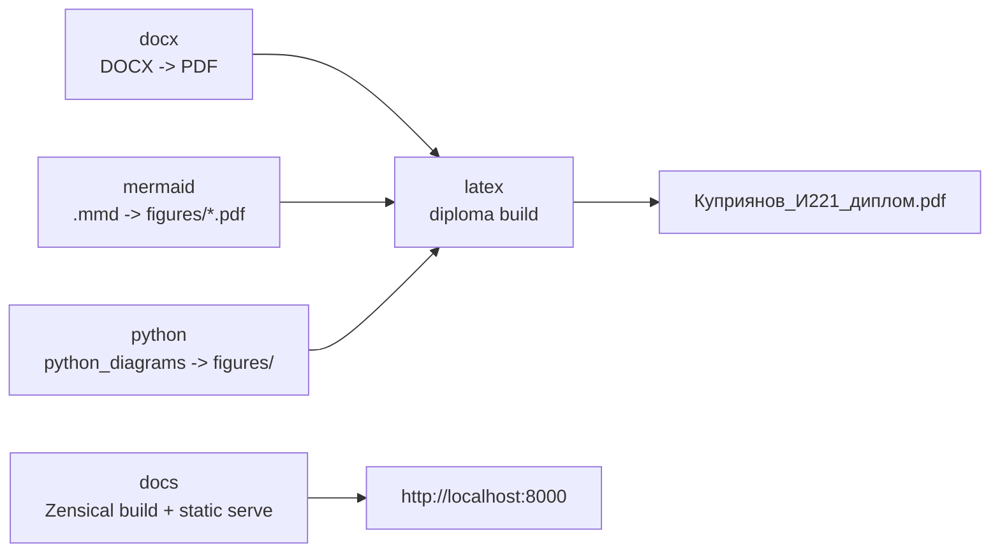
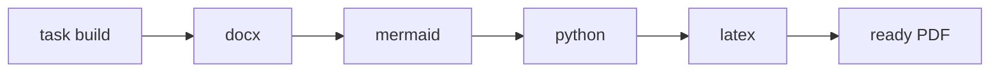

# Docker profiles



## Environment variables

Create a `.env` file in the project root:

```env
VAULT_PATH="mount path"
VAULT_OS_PATH="actual path to code on the device"
TARGET="latex file"
```

Example:

```env
VAULT_PATH="/vault_code"
VAULT_OS_PATH="../vault_diploma"
TARGET="Куприянов_И221_диплом.tex"
```

Explanation:

| Variable | Purpose |
| --- | --- |
| `VAULT_PATH` | Any absolute Unix path inside the container |
| `VAULT_OS_PATH` | Where the code is located relative to the current directory |
| `TARGET` | Main `.tex` file |

## LaTeX

Build the LaTeX image:

=== "Task"

    ```bash
    task build:image -- latex
    ```

=== "Manual"

    ```bash
    docker compose --profile latex build
    ```

Run compilation:

=== "Task"

    ```bash
    task latex:docker
    ```

=== "Manual"

    ```bash
    docker compose --profile latex run --build --rm latex
    ```

The `latex` profile runs `scripts/build_latex_docker.py`. The script reads `TARGET` from environment variables and builds the document through `latexmk`. Auxiliary files are placed into `.aux_files_docker`, and the final PDF stays in the project root. The `run --build` form checks that the image is current before starting it, so Docker does not reuse an old image after Dockerfile changes.

## Building images

Build all Docker images for the project:

=== "Task"

    ```bash
    task build:images
    ```

=== "Manual"

    ```bash
    docker compose --profile docx --profile mermaid --profile python --profile latex build
    ```

Build one profile image:

=== "Task"

    ```bash
    task build:image -- latex
    task build:image -- mermaid
    task build:image -- python
    task build:image -- docx
    ```

=== "Manual"

    ```bash
    docker compose --profile latex build
    docker compose --profile mermaid build
    docker compose --profile python build
    docker compose --profile docx build
    ```

The `scripts/build_all.py` and `scripts/diff_pdf_commits.py` scripts do not rebuild images on every run. If Docker images do not exist yet, run `task build:images` first or manually build the required images.

## Available profiles

The project uses separate Docker Compose profiles:

| Profile | Purpose |
| --- | --- |
| `docx` | Converts DOCX files from `docx/` to PDF |
| `mermaid` | Generates Mermaid diagrams into `figures/` |
| `python` | Generates diagrams with Python scripts |
| `latex` | Builds the final diploma PDF |
| `docs` | Builds and runs local bilingual documentation |

Run separate profiles:

=== "Task"

    ```bash
    task latex:docker
    task mermaid:docker
    task diagrams:docker
    task docx
    ```

=== "Manual"

    ```bash
    docker compose --profile latex run --build --rm latex
    docker compose --profile mermaid run --build --rm mermaid_diagrams
    docker compose --profile python run --build --rm python_diagrams
    docker compose --profile docx run --build --rm docx_pdf
    ```

Run all profiles with one command:

=== "Task"

    ```bash
    task compose:up
    ```

=== "Manual"

    ```bash
    docker compose --profile docx --profile mermaid --profile python --profile latex up
    ```

When all profiles are started together, Docker Compose starts services together. If you need to guarantee that the document is built with fresh PDFs from DOCX and diagrams, run `docx`, `mermaid`, and `python` first, then run `latex`.

Sequential profile execution is moved into a script:



=== "Task"

    ```bash
    task build
    ```

=== "Manual"

    ```bash
    python scripts/build_all.py
    ```
