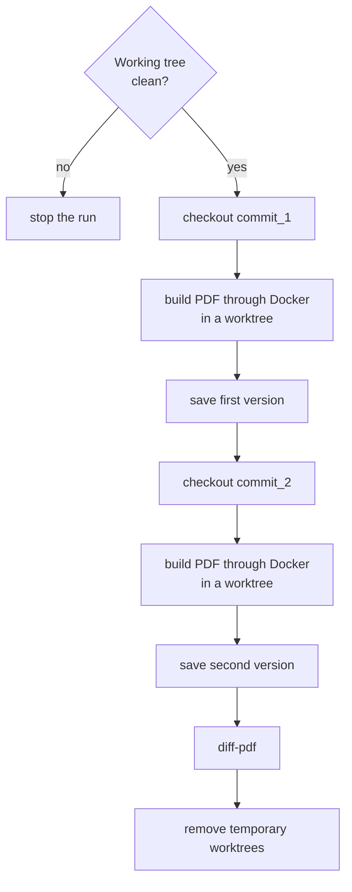
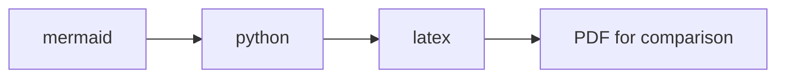

# PDF comparison between commits


If you need to inspect the visual difference between two diploma versions, use the task:

=== "Task"

    ```bash
    task diff -- <commit_1> <commit_2>
    ```

=== "Manual"

    ```bash
    uvx diff-pdf-commits --build "<build command>" --pdf "<PDF from TARGET>" --view <commit_1> <commit_2>
    ```

The `diff-pdf-commits` package accepts two commit hashes, builds the PDF in separate Docker-based worktrees, stores both versions in a temporary directory, and opens `diff-pdf`.[^diff-pdf]



The task opens the diff by default. The result can also be saved to a PDF:

=== "Task"

    ```bash
    task diff -- <commit_1> <commit_2> --view
    task diff -- <commit_1> <commit_2> --diff-output path/to/diff.pdf
    task diff -- <commit_1> <commit_2> --diff-output path/to/diff.pdf --no-view
    ```

=== "Manual"

    ```bash
    uvx diff-pdf-commits --build "<build command>" --pdf "<PDF from TARGET>" --view <commit_1> <commit_2>
    uvx diff-pdf-commits --build "<build command>" --pdf "<PDF from TARGET>" --diff-output path/to/diff.pdf <commit_1> <commit_2>
    ```

Download `diff-pdf` from the repository: <https://github.com/vslavik/diff-pdf/>

## Build



The `task diff` task passes a ready build command to `uvx diff-pdf-commits`: Mermaid diagrams first, then Python diagrams, then LaTeX. The PDF name is derived from `TARGET` in `.env` by replacing the `.tex` extension with `.pdf`. To change the sequence, edit the `DIFF_PDF_BUILD_CMD` variable in `tasks/tools.yml`.

!!! danger "Git working tree"
    Before running the task, the Git working tree must be clean. Files required for the build but possibly absent in old commits are passed with `--copy`: `.env`, title PDFs, and helper build scripts.

[^diff-pdf]: `diff-pdf` compares the visual representation of pages, not the source `.tex`. This is convenient for checking the final document: line breaks, figures, tables, and title pages are visible as changes in the PDF.
