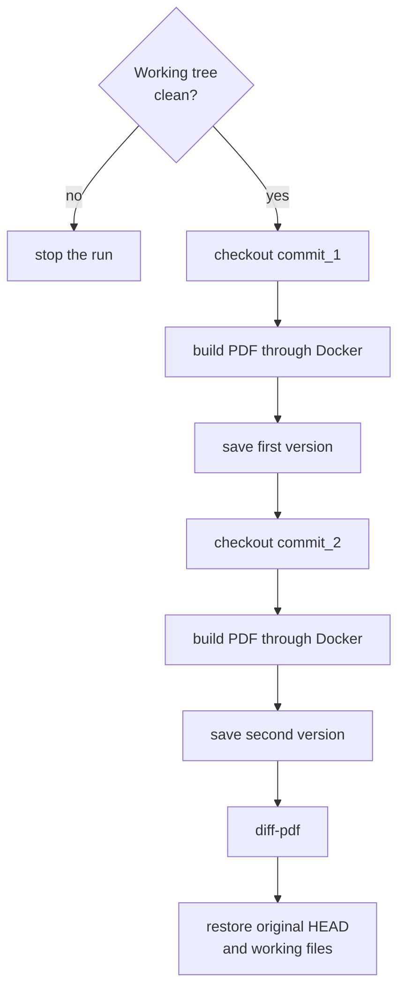
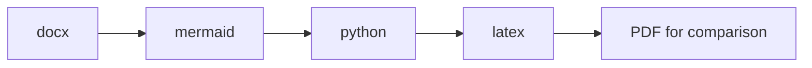

# PDF comparison between commits


If you need to inspect the visual difference between two diploma versions, use the script:

=== "Task"

    ```bash
    task diff -- <commit_1> <commit_2>
    ```

=== "Manual"

    ```bash
    uv run python scripts/diff_pdf_commits.py <commit_1> <commit_2>
    ```

The script accepts two commit hashes, checks out each one in sequence, builds the PDF through Docker, stores both versions in a temporary directory, and opens `diff-pdf`.[^diff-pdf]



The result can be opened, saved, or both:

=== "Task"

    ```bash
    task diff -- <commit_1> <commit_2> --view
    task diff -- <commit_1> <commit_2> --save
    task diff -- <commit_1> <commit_2> --view --save
    task diff -- <commit_1> <commit_2> --save path/to/diff.pdf
    ```

=== "Manual"

    ```bash
    uv run python scripts/diff_pdf_commits.py <commit_1> <commit_2> --view
    uv run python scripts/diff_pdf_commits.py <commit_1> <commit_2> --save
    uv run python scripts/diff_pdf_commits.py <commit_1> <commit_2> --view --save
    uv run python scripts/diff_pdf_commits.py <commit_1> <commit_2> --save path/to/diff.pdf
    ```

Without `--view` and `--save`, the script opens the diff. With `--save` and no path, the result is saved to `.pdf_diff/saved`.

Download `diff-pdf` from the repository: <https://github.com/vslavik/diff-pdf/>

## Build profiles

By default, all profiles are started in this order: `docx` {{ arrow }} `mermaid` {{ arrow }} `python` {{ arrow }} `latex`.



To limit the build, pass `--profiles`:

=== "Task"

    ```bash
    task diff -- <commit_1> <commit_2> --profiles all
    task diff -- <commit_1> <commit_2> --profiles docx
    task diff -- <commit_1> <commit_2> --profiles mermaid
    task diff -- <commit_1> <commit_2> --profiles python
    task diff -- <commit_1> <commit_2> --profiles mermaid,python
    task diff -- <commit_1> <commit_2> --profiles latex
    ```

=== "Manual"

    ```bash
    uv run python scripts/diff_pdf_commits.py <commit_1> <commit_2> --profiles all
    uv run python scripts/diff_pdf_commits.py <commit_1> <commit_2> --profiles docx
    uv run python scripts/diff_pdf_commits.py <commit_1> <commit_2> --profiles mermaid
    uv run python scripts/diff_pdf_commits.py <commit_1> <commit_2> --profiles python
    uv run python scripts/diff_pdf_commits.py <commit_1> <commit_2> --profiles mermaid,python
    uv run python scripts/diff_pdf_commits.py <commit_1> <commit_2> --profiles latex
    ```

Values:

| Value | What runs |
| --- | --- |
| `all` | `docx` {{ arrow }} `mermaid` {{ arrow }} `python` {{ arrow }} `latex` |
| `docx` | `docx` {{ arrow }} `latex` |
| `mermaid` | `mermaid` {{ arrow }} `latex` |
| `python` | `python` {{ arrow }} `latex` |
| `latex` | Only `latex` |
| `mermaid,python` | `mermaid` {{ arrow }} `python` {{ arrow }} `latex` |

You can pass multiple profiles to `--profiles` separated by commas: `docx,python`, `mermaid,python`, `docx,mermaid,python`. The script starts them in the order `docx` {{ arrow }} `mermaid` {{ arrow }} `python` {{ arrow }} `latex`.

If `latex` is not specified explicitly, it is added automatically because this profile builds the final PDF for comparison.

!!! danger "Git working tree"
    Before running the script, the Git working tree must be clean. After completion, the script returns to the original `HEAD`, removes temporary files, and restores current files from `figures`, as well as PDFs in the project root such as `титульник.pdf` and `задание.pdf`.

[^diff-pdf]: `diff-pdf` compares the visual representation of pages, not the source `.tex`. This is convenient for checking the final document: line breaks, figures, tables, and title pages are visible as changes in the PDF.
