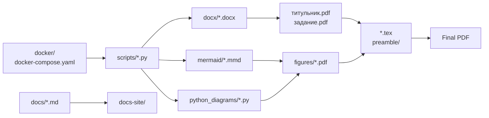

# Project structure

| Path | Purpose |
| --- | --- |
| `*.tex`, `preamble/` | LaTeX documents and preamble settings |
| `docx/` | DOCX sources for the title page and assignment |
| `mermaid/` | Mermaid diagram sources |
| `python_diagrams/` | Python scripts that generate diagrams |
| `figures/` | Generated images and PDFs inserted into the document |
| `scripts/` | Helper scripts for building, conversion, and PDF comparison |
| `docker/` | Dockerfiles for separate build profiles |
| `docs/` | Zensical documentation for the project |

Key files:

| File | Purpose |
| --- | --- |
| `Куприянов_И221_диплом.tex` | Main LaTeX file of the diploma |
| `bibliography.bib` | Bibliography for `biblatex` |
| `requirements.txt` | Python dependencies for scripts and diagrams |
| `docker-compose.yaml` | Docker Compose profiles for the project |
| `.env` | Local environment variables for the build |

The `.env` file is not committed because it contains local paths.[^env-local]

[^env-local]: `.env` can contain absolute paths for a specific machine, for example the path to the directory with appendix code. If this file is committed, the build on another machine will almost certainly point to a nonexistent location.
