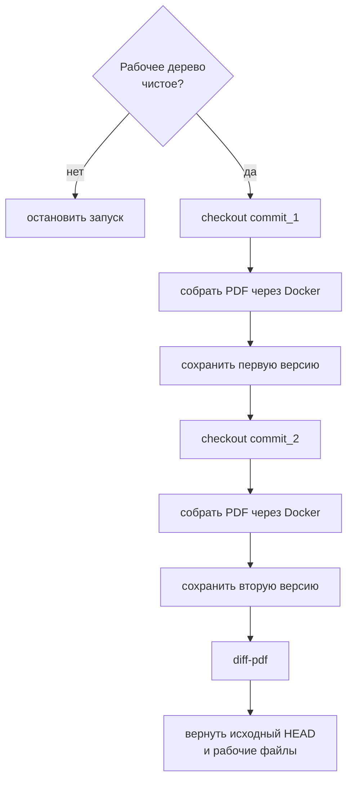
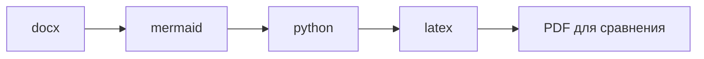

# Сравнение PDF между коммитами


Если нужно посмотреть визуальную разницу между двумя версиями диплома, используйте скрипт:


=== "Task"


    ```bash
    task diff -- <commit_1> <commit_2>
    ```


=== "Ручной"


    ```bash
    python scripts/diff_pdf_commits.py <commit_1> <commit_2>
    ```


Скрипт принимает два хэша коммита, по очереди переключается на каждый из них, собирает PDF через Docker, складывает две версии во временную папку и открывает `diff-pdf`.[^diff-pdf]



Результат можно только открыть, только сохранить или сделать оба действия:


=== "Task"


    ```bash
    task diff -- <commit_1> <commit_2> --view
    task diff -- <commit_1> <commit_2> --save
    task diff -- <commit_1> <commit_2> --view --save
    task diff -- <commit_1> <commit_2> --save path/to/diff.pdf
    ```


=== "Ручной"


    ```bash
    python scripts/diff_pdf_commits.py <commit_1> <commit_2> --view
    python scripts/diff_pdf_commits.py <commit_1> <commit_2> --save
    python scripts/diff_pdf_commits.py <commit_1> <commit_2> --view --save
    python scripts/diff_pdf_commits.py <commit_1> <commit_2> --save path/to/diff.pdf
    ```


Без `--view` и `--save` скрипт открывает diff. При `--save` без пути результат сохраняется в `.pdf_diff/saved`.

Скачать `diff-pdf` можно в репозитории: <https://github.com/vslavik/diff-pdf/>

## Профили сборки

По умолчанию запускаются все профили в порядке: `docx` {{ arrow }} `mermaid` {{ arrow }} `python` {{ arrow }} `latex`.



Если нужно ограничить сборку, передайте опцию `--profiles`:


=== "Task"


    ```bash
    task diff -- <commit_1> <commit_2> --profiles all
    task diff -- <commit_1> <commit_2> --profiles docx
    task diff -- <commit_1> <commit_2> --profiles mermaid
    task diff -- <commit_1> <commit_2> --profiles python
    task diff -- <commit_1> <commit_2> --profiles mermaid,python
    task diff -- <commit_1> <commit_2> --profiles latex
    ```


=== "Ручной"


    ```bash
    python scripts/diff_pdf_commits.py <commit_1> <commit_2> --profiles all
    python scripts/diff_pdf_commits.py <commit_1> <commit_2> --profiles docx
    python scripts/diff_pdf_commits.py <commit_1> <commit_2> --profiles mermaid
    python scripts/diff_pdf_commits.py <commit_1> <commit_2> --profiles python
    python scripts/diff_pdf_commits.py <commit_1> <commit_2> --profiles mermaid,python
    python scripts/diff_pdf_commits.py <commit_1> <commit_2> --profiles latex
    ```


Значения:

| Значение | Что запускается |
| --- | --- |
| `all` | `docx` {{ arrow }} `mermaid` {{ arrow }} `python` {{ arrow }} `latex` |
| `docx` | `docx` {{ arrow }} `latex` |
| `mermaid` | `mermaid` {{ arrow }} `latex` |
| `python` | `python` {{ arrow }} `latex` |
| `latex` | Только `latex` |
| `mermaid,python` | `mermaid` {{ arrow }} `python` {{ arrow }} `latex` |

В `--profiles` можно передать несколько профилей через запятую: `docx,python`, `mermaid,python`, `docx,mermaid,python`. Скрипт запускает их в порядке `docx` {{ arrow }} `mermaid` {{ arrow }} `python` {{ arrow }} `latex`.

Если `latex` не указан явно, он добавляется автоматически, потому что именно этот профиль собирает итоговый PDF для сравнения.

!!! danger "Рабочее дерево Git"
    Перед запуском рабочее дерево Git должно быть чистым. После завершения скрипт возвращается на исходный `HEAD`, удаляет временные файлы и восстанавливает текущие файлы из `figures`, а также PDF в корне проекта, например `титульник.pdf` и `задание.pdf`.

[^diff-pdf]: `diff-pdf` сравнивает визуальное представление страниц, а не исходный `.tex`. Это удобно для проверки итогового документа: переносы, рисунки, таблицы и титульные страницы видны как изменения в PDF.

