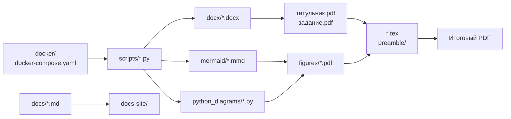

# Структура проекта

| Путь | Назначение |
| --- | --- |
| `*.tex`, `preamble/` | LaTeX-документы и настройки преамбулы |
| `docx/` | DOCX-исходники титульника и задания |
| `mermaid/` | Исходники Mermaid-диаграмм |
| `python_diagrams/` | Python-скрипты генерации диаграмм |
| `figures/` | Сгенерированные изображения и PDF для вставки в документ |
| `scripts/` | Вспомогательные скрипты сборки, конвертации и сравнения PDF |
| `docker/` | Dockerfile для отдельных профилей сборки |
| `docs/` | Zensical-документация проекта |

Ключевые файлы:

| Файл | Назначение |
| --- | --- |
| `Куприянов_И221_диплом.tex` | Основной LaTeX-файл диплома |
| `bibliography.bib` | Библиография для `biblatex` |
| `requirements.txt` | Python-зависимости для скриптов и диаграмм |
| `docker-compose.yaml` | Docker Compose профили проекта |
| `.env` | Локальные переменные окружения для сборки |

Файл `.env` не коммитится, потому что содержит локальные пути.
