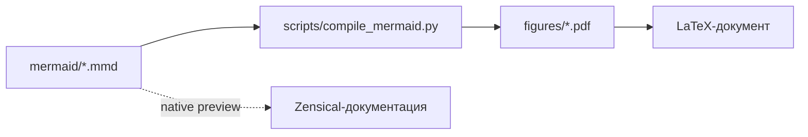
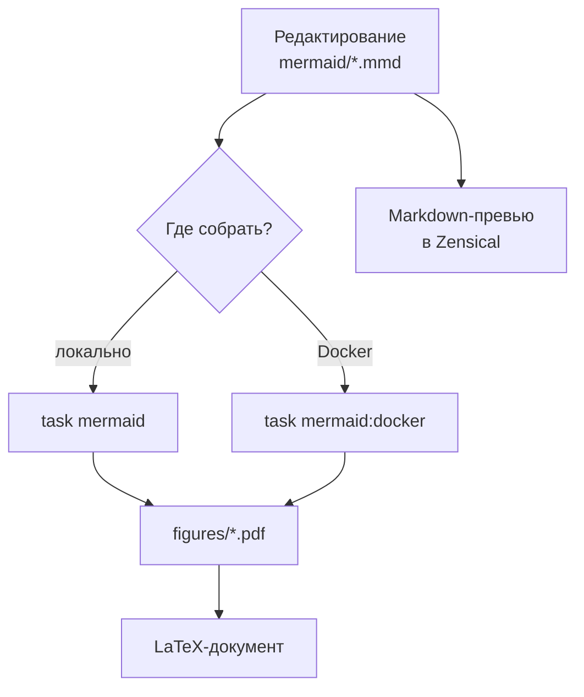
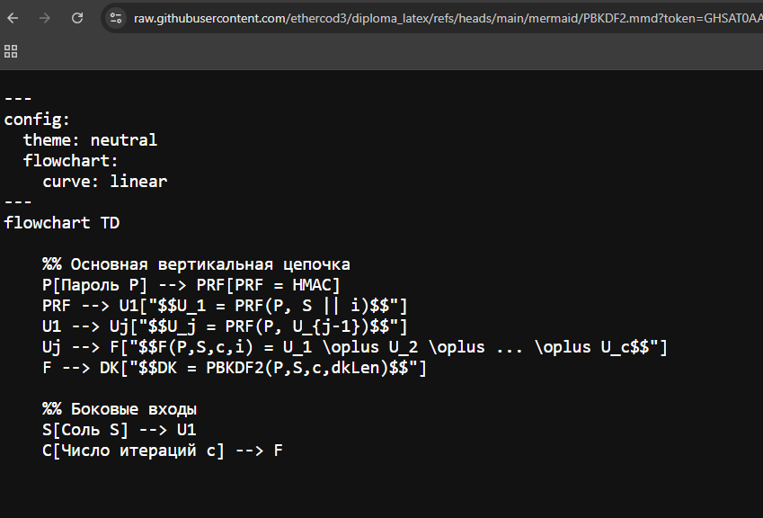

# Диаграммы

## Mermaid

Mermaid-диаграммы лежат в папке `mermaid/`, а результат сборки сохраняется в `figures/`.

В Zensical можно вставлять Mermaid напрямую в Markdown через кодовый блок `mermaid`. Такая диаграмма рендерится в браузере и автоматически подстраивается под светлую или темную тему:



Жизненный цикл диаграмм в проекте:



Для итогового PDF диплома по-прежнему нужны сгенерированные файлы из `figures/`, потому что LaTeX подключает готовые изображения.

## Просмотр `.mmd` на GitHub


GitHub не всегда показывает содержимое файлов Mermaid с расширением `.mmd` как обычный текстовый код.[^github-mermaid] Если вместо исходника отображается предпросмотр или файл не открывается удобным образом, нажмите `View raw` на странице файла. Так GitHub откроет исходный `.mmd`-код диаграммы без обработки.




## Ручная сборка Mermaid

Чтобы пересобрать диаграмму в PDF:

1. Отредактируйте нужную диаграмму в `mermaid/*.mmd`.
2. Установите `mmdc`: <https://github.com/mermaid-js/mermaid-cli>
3. Пересоберите диаграмму:

```bash
mmdc -i <file.mmd> -o <file.pdf> -f
```

Флаг `-f` нужен, чтобы `mmdc` перезаписывал уже существующий PDF. В проектной автоматической сборке поля дополнительно обрезаются через `pdfcrop`, поэтому для локального запуска нужны `pdfcrop` и Ghostscript.

## Автоматическая сборка Mermaid

Запустите скрипт:


=== "Task"


    ```bash
    task mermaid
    ```


=== "Ручной"


    ```bash
    python scripts/compile_mermaid.py
    ```


Скрипт прогоняет все файлы из `mermaid/`, кладет результат в `figures/` и после генерации обрезает поля через `pdfcrop`. Если `pdfcrop` или Ghostscript не установлены, можно временно отключить обрезку:

```bash
task mermaid -- --no-crop
```

## Mermaid через Docker

Сборка Mermaid через Docker:


=== "Task"


    ```bash
    task mermaid:docker
    ```


=== "Ручной"


    ```bash
    docker compose --profile mermaid run --build --rm mermaid_diagrams
    ```


Docker-образ Mermaid включает Chromium, Mermaid CLI, `pdfcrop` и Ghostscript, поэтому обычная команда собирает уже обрезанные PDF.


## Python-диаграммы

Python-диаграммы лежат в папке `python_diagrams/`.

Ручная сборка:

1. Установите Python. В проекте использовалась версия `3.13+`.
2. Установите зависимости:


=== "Task"


    ```bash
    task deps
    ```


=== "Ручной"


    ```bash
    pip install -r requirements.txt
    ```


3. Запустите генерацию:


=== "Task"


    ```bash
    task diagrams
    ```


=== "Ручной"


    ```bash
    python scripts/compile_python_diagrams.py
    ```


Сборка через Docker:


=== "Task"


    ```bash
    task diagrams:docker
    ```


=== "Ручной"


    ```bash
    docker compose --profile python up
    ```

[^github-mermaid]: GitHub умеет отображать Mermaid как диаграмму, но для редактирования и копирования исходника удобнее открывать raw-версию файла.
