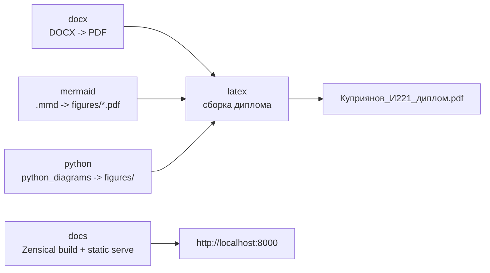
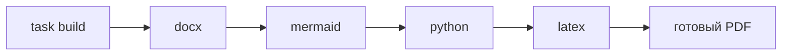

# Docker-профили



## Переменные окружения

Создайте в корне проекта файл `.env`:

```env
VAULT_PATH="путь монтирования"
VAULT_OS_PATH="фактический путь до кода на устройстве"
TARGET="файл латеха"
```

Пример:

```env
VAULT_PATH="/vault_code"
VAULT_OS_PATH="../vault_diploma"
TARGET="Куприянов_И221_диплом.tex"
```

Пояснение:

| Переменная | Назначение |
| --- | --- |
| `VAULT_PATH` | Любой абсолютный Unix-путь внутри контейнера |
| `VAULT_OS_PATH` | Где относительно текущей папки лежит код |
| `TARGET` | Основной `.tex` файл |
| `HOST_UID`, `HOST_GID` | Необязательные UID/GID пользователя для Linux CI, чтобы контейнеры писали в bind mount без проблем с правами |

## LaTeX

Соберите LaTeX-образ:


=== "Task"


    ```bash
    task build:image -- latex
    ```


=== "Ручной"


    ```bash
    docker compose --profile latex build
    ```


Запустите компиляцию:


=== "Task"


    ```bash
    task latex:docker
    ```


=== "Ручной"


    ```bash
    docker compose --profile latex run --build --rm latex
    ```


Профиль `latex` запускает `scripts/build_latex_docker.py`. Скрипт читает `TARGET` из переменных окружения и собирает документ через `latexmk`. Вспомогательные файлы складываются в `.aux_files_docker`, а готовый PDF остается в корне проекта. Вариант `run --build` перед запуском проверяет актуальность образа, чтобы Docker не использовал старую версию после изменения Dockerfile.

## Сборка образов

Собрать все Docker-образы проекта:


=== "Task"


    ```bash
    task build:images
    ```


=== "Ручной"


    ```bash
    docker compose --profile docx --profile mermaid --profile python --profile latex --profile crop build
    ```


Собрать образ отдельного профиля:


=== "Task"


    ```bash
    task build:image -- latex
    task build:image -- mermaid
    task build:image -- python
    task build:image -- docx
    task build:image -- crop
    ```


=== "Ручной"


    ```bash
    docker compose --profile latex build
    docker compose --profile mermaid build
    docker compose --profile python build
    docker compose --profile docx build
    docker compose --profile crop build
    ```


Команды профилей используют `docker compose run --build`, поэтому Docker проверяет актуальность образов перед запуском. Первый запуск все равно будет долгим: Docker скачает базовые образы и соберет окружение.

## Доступные профили

В проекте используются отдельные Docker Compose профили:

| Профиль | Назначение |
| --- | --- |
| `docx` | Конвертирует DOCX-файлы из `docx/` в PDF |
| `mermaid` | Генерирует Mermaid-диаграммы в `figures/` |
| `python` | Генерирует диаграммы Python-скриптами |
| `latex` | Собирает итоговый PDF диплома |
| `crop` | Обрезает поля произвольного PDF через `pdfcrop` |
| `stirling` | Поднимает Stirling PDF для ручной проверки PDF в браузере |
| `docs` | Собирает и поднимает локальную двуязычную документацию |

Запуск отдельных профилей:


=== "Task"


    ```bash
    task latex:docker
    task mermaid:docker
    task diagrams:docker
    task docx
    task crop:docker -- path/to/file.pdf
    task stirling
    ```


=== "Ручной"


    ```bash
    docker compose --profile latex run --build --rm latex
    docker compose --profile mermaid run --build --rm mermaid_diagrams
    docker compose --profile python run --build --rm python_diagrams
    docker compose --profile docx run --build --rm docx_pdf
    docker compose --profile crop run --build --rm crop_pdf python3 scripts/crop_pdf.py path/to/file.pdf
    docker compose --profile stirling up -d stirling_pdf
    ```

Для Stirling PDF доступны дополнительные команды:

```bash
task stirling:logs
task stirling:down
```

Подробности по запуску, переменным окружения и стартовому паролю администратора вынесены в отдельную страницу: [Stirling PDF](stirling.md).


Запуск всех профилей одной командой:


=== "Task"


    ```bash
    task compose:up
    ```


=== "Ручной"


    ```bash
    docker compose --profile docx --profile mermaid --profile python --profile latex up
    ```


При запуске всех профилей Docker Compose стартует сервисы вместе. Если нужно гарантированно собрать документ уже со свежими PDF из DOCX и диаграммами, сначала запустите профили `docx`, `mermaid` и `python`, затем профиль `latex`.

Последовательный запуск всех профилей вынесен в скрипт:




=== "Task"


    ```bash
    task build
    ```


=== "Ручной"


    ```bash
    uv run python scripts/build_all.py
    ```

`scripts/build_all.py` запускает профили по порядку `docx` {{ arrow }} `mermaid` {{ arrow }} `python` {{ arrow }} `latex` и останавливается на первой ошибке.

!!! note "Права на файлы в Linux CI"
    В GitHub Actions workflow записывает в `.env` `HOST_UID` и `HOST_GID`. Docker Compose использует эти значения в `user: "${HOST_UID:-0}:${HOST_GID:-0}"`, чтобы контейнеры создавали PDF и диаграммы от имени пользователя runner. Локально без этих переменных используется fallback `0:0`.
