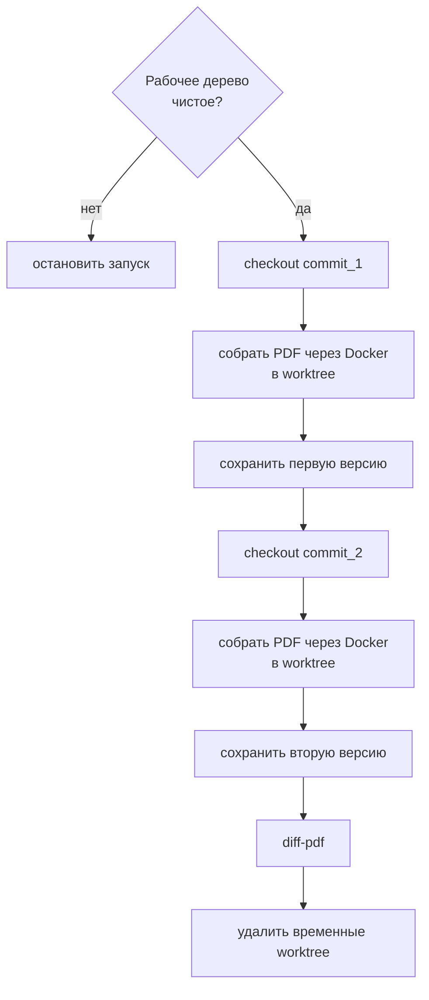
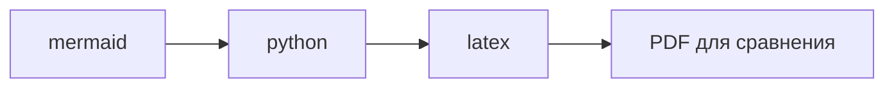

# Сравнение PDF между коммитами


Если нужно посмотреть визуальную разницу между двумя версиями диплома, используйте задачу:


=== "Task"


    ```bash
    task diff -- <commit_1> <commit_2>
    ```


=== "Ручной"


    ```bash
    uvx diff-pdf-commits --build "<команда сборки>" --pdf "<PDF из TARGET>" --view <commit_1> <commit_2>
    ```


Пакет `diff-pdf-commits` принимает два хэша коммита, собирает PDF в отдельных worktree через Docker, складывает две версии во временную папку и открывает `diff-pdf`.[^diff-pdf]



По умолчанию задача открывает diff. Результат можно также сохранить в PDF:


=== "Task"


    ```bash
    task diff -- <commit_1> <commit_2> --view
    task diff -- <commit_1> <commit_2> --diff-output path/to/diff.pdf
    task diff -- <commit_1> <commit_2> --diff-output path/to/diff.pdf --no-view
    ```


=== "Ручной"


    ```bash
    uvx diff-pdf-commits --build "<команда сборки>" --pdf "<PDF из TARGET>" --view <commit_1> <commit_2>
    uvx diff-pdf-commits --build "<команда сборки>" --pdf "<PDF из TARGET>" --diff-output path/to/diff.pdf <commit_1> <commit_2>
    ```


Скачать `diff-pdf` можно в репозитории: <https://github.com/vslavik/diff-pdf/>

## Сборка



Задача `task diff` передает в `uvx diff-pdf-commits` готовую команду сборки: сначала Mermaid-диаграммы, затем Python-диаграммы, затем LaTeX. Имя PDF берется из `TARGET` в `.env` заменой расширения `.tex` на `.pdf`. Если нужно изменить последовательность, правьте переменную `DIFF_PDF_BUILD_CMD` в `tasks/tools.yml`.

!!! danger "Рабочее дерево Git"
    Перед запуском рабочее дерево Git должно быть чистым. Файлы, которые нужны для сборки, но могут отсутствовать в старых коммитах, задача передает через `--copy`: `.env`, титульные PDF и вспомогательные build-скрипты.

[^diff-pdf]: `diff-pdf` сравнивает визуальное представление страниц, а не исходный `.tex`. Это удобно для проверки итогового документа: переносы, рисунки, таблицы и титульные страницы видны как изменения в PDF.

