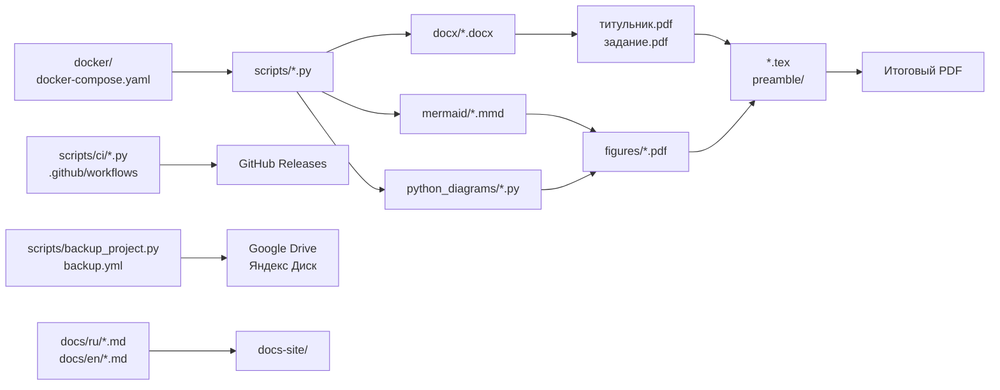

# Структура проекта

| Путь | Назначение |
| --- | --- |
| `*.tex`, `preamble/` | LaTeX-документы и настройки преамбулы |
| `docx/` | DOCX-исходники титульника и задания |
| `mermaid/` | Исходники Mermaid-диаграмм |
| `python_diagrams/` | Python-скрипты генерации диаграмм |
| `figures/` | Сгенерированные изображения и PDF для вставки в документ |
| `scripts/` | Вспомогательные скрипты сборки, конвертации, сравнения PDF и резервного копирования |
| `scripts/ci/` | Python-скрипты для GitHub Actions и публикации релизов |
| `docker/` | Dockerfile для отдельных профилей сборки |
| `docs/ru/`, `docs/en/` | Zensical-документация проекта |
| `docs/includes/` | Общие Markdown-вставки для Zensical-документации |
| `tasks/` | Тематические Taskfile с командами сборки и обслуживания; список команд доступен через `task --list` |
| `tests/` | Pytest-тесты чистой логики вспомогательных скриптов |
| `.github/workflows/` | GitHub Actions для Pages, check tools, PDF releases и backup |

Ключевые файлы:

| Файл | Назначение |
| --- | --- |
| `Куприянов_И221_диплом.tex` | Основной LaTeX-файл диплома |
| `bibliography.bib` | Библиография для `biblatex` |
| `pyproject.toml` | Python-зависимости и настройки Python-инструментов, включая Black |
| `uv.lock` | Зафиксированные версии зависимостей |
| `docker-compose.yaml` | Docker Compose профили проекта |
| `docker-compose.ci-cache.yaml` | CI-only Compose override для кэша Docker BuildKit в GitHub Actions |
| `Taskfile.yml` | Единая точка входа Task, подключающая файлы из `tasks/` |
| `.env` | Локальные переменные окружения для сборки |

Файл `.env` не коммитится, потому что содержит локальные пути.[^env-local]

[^env-local]: В `.env` могут быть абсолютные пути конкретной машины, например путь к каталогу с кодом для приложений. Если такой файл попадет в репозиторий, сборка на другой машине почти наверняка будет смотреть в несуществующее место.
