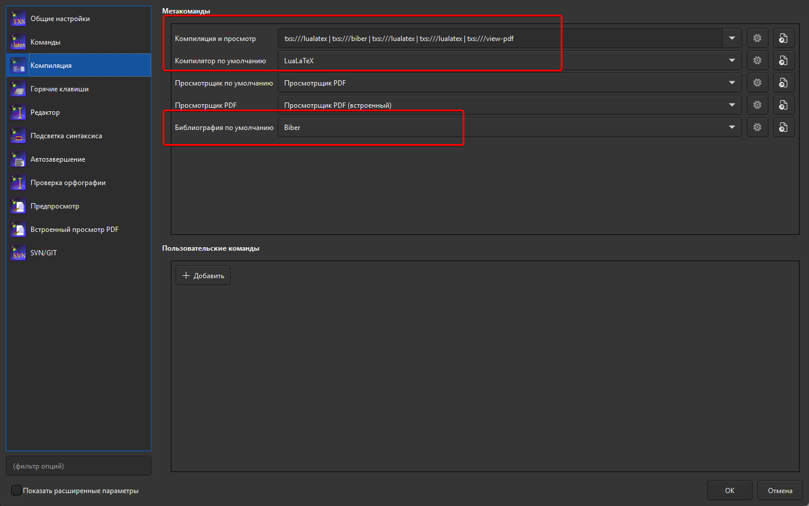

# Настройка TeXstudio

Проект использует `LuaLaTeX` и `biblatex` с backend `biber`. Рекомендуемый вариант для TeXstudio - запускать `latexmk`, который читает настройки из `.latexmkrc`.

1. Откройте `Options` {{ arrow }} `Configure TeXstudio` {{ arrow }} `Commands`.


2. В поле `Latexmk` укажите:

```text
latexmk %.tex
```

3. Откройте `Options` {{ arrow }} `Configure TeXstudio` {{ arrow }} `Build`.

4. В `Default Compiler` выберите `Latexmk`.



Перед первой сборкой убедитесь, что `latexmk`, `lualatex` и `biber` доступны в `PATH`. При установке TeX Live они обычно уже доступны вместе с дистрибутивом. Готовый PDF будет создан в корне проекта, вспомогательные файлы - в `.aux_files`.

Полностью ручная схема с отдельными запусками `lualatex` и `biber` описана в конце раздела [Сборка без Docker](manual-build.md#_3).

